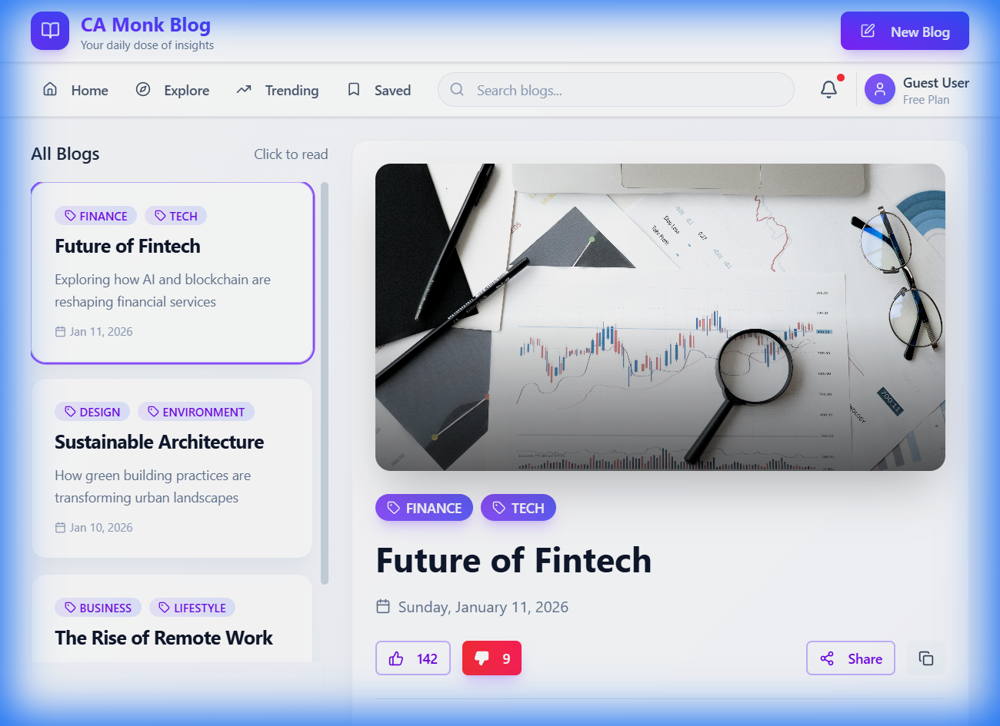

# 📝 CA Monk Blog Application

A modern, responsive blog application built with React, TypeScript, TanStack Query, and Tailwind CSS. Features a beautiful UI with shadcn/ui-style components.



---

## 📖 Description

CA Monk Blog is a full-featured blog platform that allows users to browse, read, and create blog posts. The application features a clean split-panel layout with a blog list on the left and detailed content on the right. Built with modern web technologies and best practices, it showcases proper state management, API integration, and responsive design.

---

## ✨ Features

### Core Functionality
- 📚 **Browse All Blogs** - View all blog posts in a scrollable card-based list
- 📖 **Read Blog Details** - Full blog view with cover image, categories, and content
- ✍️ **Create New Blog** - Rich form to create new blog posts with real-time preview
- 👍 **Like & Dislike** - Interactive reaction buttons with real-time count updates
- 🔗 **Share** - Native share dialog or copy-to-clipboard functionality

### UI/UX
- 🎨 **Modern Design** - Glassmorphism effects, gradients, and micro-animations
- 📱 **Responsive Layout** - Works seamlessly on desktop and mobile devices
- ⏳ **Loading Skeletons** - Smooth loading states for better UX
- ❌ **Error Handling** - User-friendly error messages
- 🔔 **Decorative Navbar** - Navigation with Home, Explore, Trending, Saved, Search, and User Profile

---

## 🛠️ Tech Stack

| Technology | Purpose |
|------------|---------|
| **React 19** | UI Framework |
| **TypeScript** | Type Safety |
| **Vite** | Build Tool & Dev Server |
| **TanStack Query** | Server State Management |
| **Tailwind CSS v4** | Styling |
| **shadcn/ui style** | UI Components |
| **Lucide React** | Icons |
| **JSON Server** | Mock Backend API |

---

## 📁 Project Structure

```
camonk-blog/
├── public/                     # Static assets
├── screenshots/                # App screenshots
├── src/
│   ├── api/
│   │   └── blogs.ts           # API functions
│   ├── components/
│   │   ├── ui/                # Reusable UI components
│   │   │   ├── button.tsx
│   │   │   ├── card.tsx
│   │   │   ├── input.tsx
│   │   │   ├── textarea.tsx
│   │   │   └── skeleton.tsx
│   │   ├── BlogList.tsx       # Blog list component
│   │   ├── BlogDetail.tsx     # Blog detail view
│   │   ├── CreateBlog.tsx     # Create blog form
│   │   └── Navbar.tsx         # Navigation bar
│   ├── lib/
│   │   └── utils.ts           # Utility functions
│   ├── types/
│   │   └── blog.ts            # TypeScript interfaces
│   ├── App.tsx                # Main app component
│   ├── main.tsx               # Entry point
│   └── index.css              # Global styles
├── db.json                     # Mock database
├── package.json
├── tailwind.config.js
├── tsconfig.json
└── vite.config.ts
```

---

## 🚀 Getting Started

### Prerequisites
- Node.js v18 or higher
- npm or yarn

### Installation

1. **Clone the repository**
   ```bash
   git clone <repository-url>
   cd camonk-blog
   ```

2. **Install dependencies**
   ```bash
   npm install
   ```

3. **Start the JSON Server (Backend API)**
   ```bash
   npm run server
   ```
   The API will run on `http://localhost:3001`

4. **Start the Development Server** (in a new terminal)
   ```bash
   npm run dev
   ```
   The app will run on `http://localhost:5173`

### Available Scripts

| Command | Description |
|---------|-------------|
| `npm run dev` | Start development server |
| `npm run server` | Start JSON Server |
| `npm run build` | Build for production |
| `npm run preview` | Preview production build |
| `npm run lint` | Run ESLint |

---

## 📸 Screenshots

### Main View with Blog Details


### Create Blog Modal


---

## 💡 Use Cases

1. **Personal Blog** - Share your thoughts and ideas with the world
2. **Company Blog** - Publish company news and updates
3. **Portfolio** - Showcase your projects and achievements
4. **Knowledge Base** - Create and organize educational content
5. **News Platform** - Aggregate and display news articles

---

## 🔌 API Endpoints

| Method | Endpoint | Description |
|--------|----------|-------------|
| GET | `/blogs` | Get all blogs |
| GET | `/blogs/:id` | Get blog by ID |
| POST | `/blogs` | Create a new blog |

### Sample Blog Object
```json
{
  "id": "1",
  "title": "Future of Fintech",
  "category": ["FINANCE", "TECH"],
  "description": "Exploring how AI and blockchain are reshaping financial services",
  "date": "2026-01-11T09:12:45.120Z",
  "coverImage": "https://images.pexels.com/photos/6801648/pexels-photo-6801648.jpeg",
  "content": "Full blog content...",
  "likes": 142,
  "dislikes": 8
}
```

---

## 🙏 Acknowledgements

- [React](https://react.dev/) - UI library
- [TanStack Query](https://tanstack.com/query) - Data fetching & caching
- [Tailwind CSS](https://tailwindcss.com/) - Utility-first CSS framework
- [shadcn/ui](https://ui.shadcn.com/) - Component design inspiration
- [Lucide](https://lucide.dev/) - Beautiful icons
- [Pexels](https://www.pexels.com/) - Free stock images
- [JSON Server](https://github.com/typicode/json-server) - Mock REST API

---

## 📄 License

This project is open source and available under the [MIT License](LICENSE).

---

## 👨‍💻 Author

Built with ❤️ for the CA Monk Frontend Interview Assignment

---

> **Note**: This is an assignment project demonstrating React, TypeScript, TanStack Query, Tailwind CSS, and shadcn/ui integration skills.
